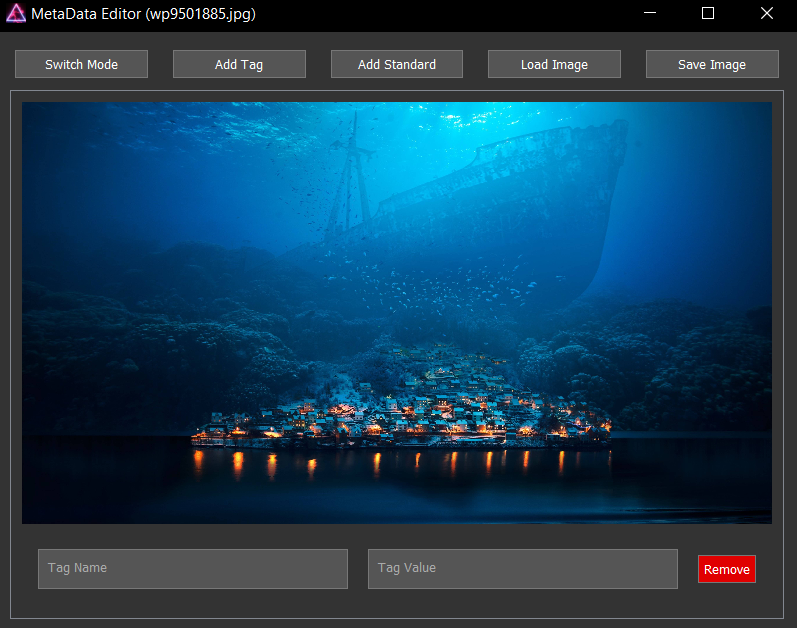

# Raspberry Pi Slide-Show

## Table of Contents

1. [Introduction](#introduction)
2. [Setting up Google Cloud Project](#setting-up-google-cloud-project)
3. [Prerequisites and Packages Installation](#prerequisites-and-packages-installation)
4. [Project Setup](#project-setup)
5. [Meta-Data-Editor](#metadataeditor)
6. [Allowed File Formats](#allowed-file-formats)
7. [Allowed Date Formats for Google Drive](#allowed-date-formats-for-google-drive)
8. [Auto-start Configuration](#auto-start-configuration)

## Introduction

Welcome to the TerminalSlideShow repository. This project is a lightweight, non-GUI slideshow that fetches new files from Google Drive, allowing you to update the slideshow remotely. 
This README provides instructions for setting up the project using Python, installing necessary requirements, configuring a Google Cloud project, and setting up auto-start functionality.


## Setting up Google Cloud Project

Follow these steps to set up the Google Cloud project and obtain necessary credentials:

1. Create a new project on [Google Cloud Console](https://console.cloud.google.com/).
2. Navigate to "Service Accounts" on the left navbar and create a new service account with drive permissions.
3. Add a key in JSON format for the service account.
4. Use the email to grant permission to the target folder.


## Prerequisites and Packages Installation
Ensure you have Python version ``3.9.2`` or higher installed.

#### Easy-Way-Install
- Execute: the ``initialize.sh`` inside th projectfolder

#### Update
- To get newest repo version: ``python -m update.py --update``

#### Manual-Way-Install:
Execute the following commands:
- install venv for python: ``sudo apt-get install python3-venv``
- create a venv: ``python -m venv venv``
- always use the venv: ``source path/to/venv/bin/activate``
- Install requirements using: `pip install -r requirements.txt`

```bash
# Update package information
sudo apt update

# Upgrade installed packages
sudo apt upgrade

# Install required packages:
sudo apt install fbi vlc jq
sudo apt install libimage-exiftool-perl
sudo apt-get install python3-pyqt5

#for MetaDataEdtor on MAC:
brew install exiftool
# Download the executable for windows: https://exiftool.org/

# Install recommended packages:
sudo apt install dos2unix
```

## Project-Setup
To start you have to set some variables inside the [config-file](app_config.json)

#### Python Variables:
- ``TARGETDIR`` -> folder where the content will be saved
- ``USE_GDRIVE`` -> If you want to get the content from Google-Drive set it ``true``
- ``GOOGLE_API_ACCESS`` -> Specifies the path to you service_account json file
- ``DRIVE_DIR_ID`` -> The ID of the Google-Drive folder with your content

#### Bash Variables:
- ``ON_TIME`` and ``OFF_TIME`` -> Time when it should display
- ``DISPLAYTIME`` -> Time for Duration of each image (in seconds)
- ``BLENDTIME`` -> Time for blending animation (in milliseconds)
- ``PYENV`` -> Path to the venv if you are using one

## MetaDataEditor
[App](MetaDataEditor/app.py)



- Allows to add custom Tags to the file using a GUI
- `STARTDATE` -> Date when it will beginn displaying
- `ENDDATE` -> Date when it will stop displaying


## Allowed File Formats

- The script supports the following image formats: ``.jpg``, ``.jpeg``, ``.png``, ``bmp``, ``.gif(first frame)``.

- The script supports the following video formats: ``.mp4``, ``.mkv``, ``.avi``, ``.ogg``, ``mov``, ``flv``.
-> Video currently not working using MetaDataEditor

## Allowed Formats for Google Drive

- The script supports the following date formats for filenames: ``day.month.year``, ``5.5.23``, ``05.05.2023``, ``15-06-2023``, ``20_07_2023``

- You can also add a name before and after: ``FILENAME5.5.23stufff``

- To set a time range use `@`: `5.5.23@08-12-23`

## Auto-start Configuration

To configure auto-start:

- Open the rc.local file: `sudo nano /etc/rc.local`
- Add `sudo reset` to an empty command line
- Go to the crontabs: `crontab -e`
- Add 'chmod' to set the script as always executable and add the path to the script:
```bash
@reboot sudo sleep 8 && cd /path/to/project && sudo chmod +x path/to/script.sh && path/to/script.sh >/dev/null 2>/dev/null

# recommended
@reboot sudo sleep 8 && cd /path/to/project && dos2unix ./script.sh && sudo chmod +x ./script.sh && ./script.sh >/dev/null 2>/dev/null
```
